# ML 스터디 10주차 : SVM, Random Forest

## **남궁선**
## Random Forest

### 1. Decision Tree(의사결정트리) 의 단점
- 주어진 학습 데이터에 따라 생성되는 의사결정트리의 모델이 일정하지 않아 일반화를 할 수 없다.
- 상위 노드의 에러가 다음 노드로 전파된다.
- 의사결정트리를 활용한 학습결과가 일정하지 않다.

> ***Decision Tree의 내용은 [9주차](../9주차)를 참고해 주세요.***

### 2. Random Forest의 정의
- 랜덤 포레스트는 여러 개의 의사결정트리들을 임의적으로 학습하는 방식의 앙상블 학습법.
  
> ***앙상블 학습법이란 데이터를 사용해 n개의 데이터 집합을 만든 뒤, m개의 모델에 나누어 학습시킨 뒤 각 결과들을 종합하는 학습법(n =< m)***

### 3. Random Forest의 장점
- 월등히 높은 정확성
- 간편하고 빠른 학습 및 테스트 알고리즘
- 변수소거 없이 수천 개의 입력 변수들을 다루는 것이 가능
- 임의화를 통한 좋은 일반화 성능
- 다중 클래스 알고리즘 특성

### 4. Random Forest의 특징
- 랜덤 포레스트의 가장 핵심적인 특징은 임의성(randomness)에 의해 서로 조금씩 다른 특성을 갖는 트리들로 구성된다는 것이다. 이 특징은 각 트리들의 예측(prediction)들이 비상관화(decorrelation) 되게하며, 결과적으로 일반화(generalization) 성능을 향상시킨다. 또한, 임의화(randomization)는 포레스트가 노이즈가 포함된 데이터에 대해서도 강인하게 만들어 준다. 임의화는 각 트리들의 훈련 과정에서 진행되며, 가장 널리 쓰이는 두 가지 방법으로는 임의 학습 데이터 추출 방법을 이용한 앙상블 학습법인 배깅(bagging)과 임의 노드 최적화(randomized node optimization)가 있다. 이 두 가지 방법은 서로 동시에 사용되어 임의화 특성을 더욱 증진 시킬 수 있다.

### 5. Bagging
- ***배깅(bagging)*** 은 bootstrap aggregating의 약자로, 부트스트랩(bootstrap)을 통해 조금씩 다른 훈련 데이터에 대해 훈련된 기초 분류기(base learner)들을 결합(aggregating)시키는 방법이다(앙상블).
- ***부트스트랩*** 이란, 주어진 훈련 데이터에서 중복을 허용하여 원 데이터와 같은 크기의 데이터를 만드는 과정을 말한다.
  
- 

- 트리는 작은 편향(bias)과 큰 분산(variance)을 갖기 때문에, 매우 깊이 성장한 트리는 훈련 데이터에 대해 오버피팅하게 된다. 부트스트랩 과정은 트리들의 편향은 그대로 유지하면서, 분산은 감소시키기 때문에 포레스트의 성능을 향상시킨다. 즉, 한 개의 결정 트리의 경우 훈련 데이터에 있는 노이즈에 대해서 매우 민감하지만, 트리들이 서로 상관화(correlated)되어 있지 않다면 여러 트리들의 평균은 노이즈에 대해 강인해진다. 포레스트를 구성하는 모든 트리들을 동일한 데이터 집합으로만 훈련시키게 되면, 트리들의 상관성(correlation)은 굉장히 커질 것이다. 따라서 배깅은 서로 다른 데이터 집합들에 대해 훈련 시킴으로써, 트리들을 비상관화시켜 주는 과정이다.

### 6. Bagging을 이용한 Random Forest 학습법
1. 주어진 트레이닝 데이터에서 중복을 허용하여 N개를 선택한다.(부트스트랩)
2. 선택한 N개의 데이터 샘플에서 특성값을 중복없이 d개를 선택한다.
3. 1~2 단계를 T번 반복하여 T개의 훈련 데이터 집합을 생성한다.
4. T개의 트리들을 훈련시킨다.
5. T개의 트리들에서 예측된 결과들을 평균이나(앙상블) 가장 많이 예측된 결과를 선택하여 최종 결과로 결정한다.

### 7. 주요 Hyperparameter
- 포레스트의 크기 (트리의 개수) T
  - 총 포레스트를 몇 개의 트리로 구성할 지를 결정하는 매개변수이다. 포레스트가 작으면 트리들을 구성하고 테스트 하는데 걸리는 시간이 짧은 대신, 일반화 능력이 떨어져 임의의 입력 데이터 포인트에 대해 틀린 결과를 내놓을 확률이 높다. 반면에 포레스트의 크기가 크다면 훈련과 테스트 시간은 증가하지만, 포레스트의 결과값은 각 트리의 결과들에 평균을 취한 것으로 큰 포레스트의 결과값은 작은 포레스트보다 비교적 연속적이며 일반화 능력이 우수하다.
- 최대 허용 깊이 D
  - 하나의 트리에서 루트 노드부터 종단 노드까지 최대 몇개의 노드(테스트)를 거칠 것인지를 결정하는 매개변수이다. 최대 허용 깊이가 작으면 과소적합(underfitting)이 일어나고, 최대 허용 깊이가 크면 과대적합(overfitting)이 일어나기 때문에 적절한 값을 설정하는 것이 중요하다.
  
- Subsampling 추출 속성 수 (d)
    - 회귀 문제에서 1/3 정도의 속성을 추천
    - 분류에서는 전체 속성 개수의 제곱근을 추천
-------------------
## **정초이**

# Support Vector Machine (SVM)

## 서포트 벡터 머신?

- 기계학습 분야 중 하나. 패턴인식, 자료분석을 위한 지도학습 모델분류와 회귀분석을 위해 사용
- 기존의 분류방법들과 기본 원리가 크게 다름
  - 기존의 방법들 (신경망 포함) : 목적 = 오류율 최소화
  - SVM : 목적 = 두 부류 사이에 존재하는 **여백을 최대화**
- 딥러닝이 나오기 전까지 가장 성공적인 분류기 역할을 했음

### SVM의 패턴 인식 순서

1. 두 카테고리 중 어느 하나에 속한 데이터 집합이 주어짐
2. 주어진 데이터 집합을 바탕으로 new 데이터가 어느 카테고리에 속하는지 판단하는 비확률적 이진 선형/비선형분류모델을 만듦
3. 만들어진 분류모델은 데이터가 사상된 공간에서 경계로 표현됨
4. SVM 알고리즘은 그 중 가장 큰 폭을 가진 경계를 찾음

## Maximal Margin Classifier

: 1962년

#### 예를 들어 설명

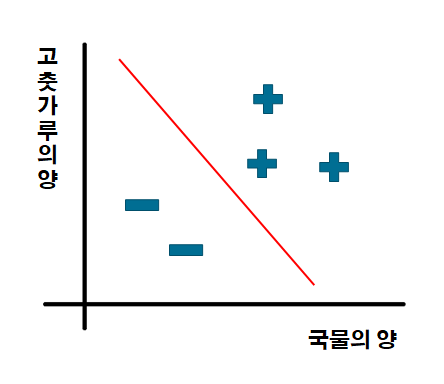

- 짜장면인지 짬뽕인지 직선을 그어서 구분하는 것.
- 이 때 잘 분류한 것 = 두 부류 사이의 여백이 가장 넓어진 것
- 분류는 선형 모델 (직선) / 비선형 모델 (곡선) 으로 둘을 구분할 수 있음
  - 일반적으로 선형 방식에 적합한 classifier 이긴 함.

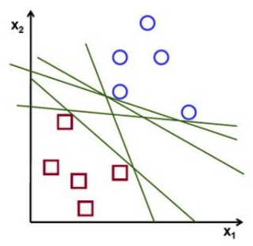

- 위 결정 영역 중 최적 —> 결정 영역 근처에 있는 '분류하기 애매한' 데이터의 거리가 최대가 되어야 함

## 마진, 서포트 벡터

- SVM을 사용하기 위한 기본 요건. 선형관계에서 사용되는 두가지 중요한 포인트
  - 비선형 부분 : 여기다가 추가로 kernel 이라는 요소가 필요함

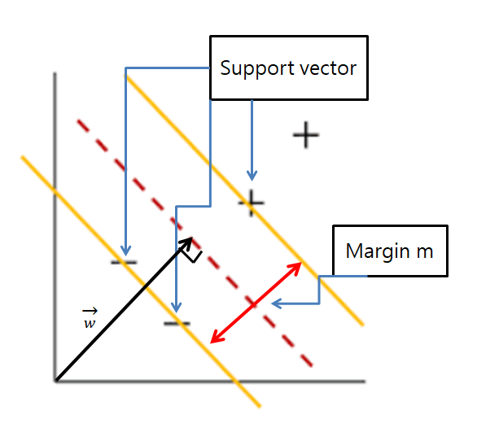

### 마진

어떠한 점들도 포함하지 않는 영역

support vector를 통해 구한 두 카테고리 사이의 거리 = m

마진을 최대화해서 클래스들을 분리할 수 있도록 만듦

### 서포트 벡터

두 가지 카테고리에 각각 해당되는 데이터 셋들 (네모가 모인 곳 / 동그라미가 모인 곳)의 최외각에 있는 샘플들.

결정 경계선에 가장 가까이 있는 각 클래스의 데이터 점

이 가장 최외각에 있는 벡터들을 토대로 margin M을 구할 수 있음 —> 중요한 벡터들 !

> 벡터 : 데이터 하나를 표현하는 단위 같은 느낌..?

서포트 벡터 덕분에 새로운 data point가 들어왔을 때 전체 data를 고려하지 않아도 support vector 와의 내적 거리를 계산할 수 있음 —> 계산비용과 계산시간의 감소

그림에서 +, - 샘플들 —> 선형으로 분리가 가능한 상황.

**빨간 점선** —> margin이 최대가 되는 직선.

==> 직선을 통해 두 data set을 분리하자. 이떄 이 직선 : **결정 초평면**(decision hyperline)

### 결정 초평면

#### 초평면?

- 어떤 N 차원 공간에서 한 차원 낮은 N-1 차원의 subspace
  - ex) 3차원: 면, 2차원: 선
- 지금 살펴볼 내용은 기본적으로 2차원을 다루므로 초평면이 선임.
- 최적의 결정 초평면을 구하는 이유
  - training data에 대해서 알맞은 분류를 하기 위해
  - 모델에 대해 일반화시켜 아직 설정되지 않은 새로운 data들에 대해서도 잘 분류 하게끔 만들어 주기 위해서

### Maximal Margin Classifier

여러 가능한 초평면들 중 Support Vector로 부터 가장 멀리 떨어진 분리 초평면을 선택한다.

그런 초평면으로 분류를 하는 기법을 **Maximal Margin Classifier** 라고 한다.

> 보통 Kernel을 적용하지 않은 기본 SVM 이라고도 말하는 것 같다.

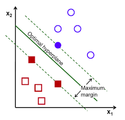

## Maximizing margin

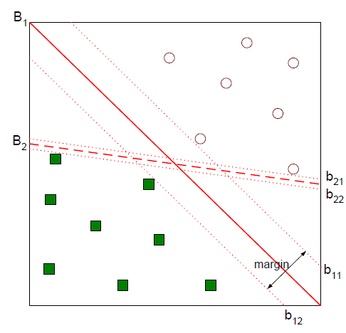

이 그림에서 더 나은 분류 경계면 : B1

margin : b12 (minus plane) 와 b11 (plus plane) 사이의 거리.

#### margin을 도식적으로 나타내기

우리가 초평면과 plus,minus plane 사이의 거리를 같게 설정했으므로 원래 동일하게 δ 만큼 떨어져야 한다.

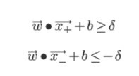

하지만 어차피 w, b 둘 다 모르는 수이기 때문에 임의의 δ로 나누어 주어도 임의의 숫자이다.

그러므로 δ에 대해 정규화해서 우변을 1과 같이 표기할 수 있다.

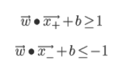

이러한 제약조건을 하나로 표현하기 위해 yi 라는 변수를 도입한다.

이를 통해 두 식을 하나로 정리할 수 있다.

식의 의미

: plus-plane 보다 위에 있는 관측치들은 wTx + b 가 1보다 크다.

여기서 새로운 제약조건을 추가한다.

**등호가 성립하는 경우 : 각각 빨간 점선에 샘플들이 걸쳐있는 경우**

margin : b12 (minus plane) 와 b11 (plus plane) 사이의 거리이고, SVM은 그 margin을 최대화하는 분류 경계면을 찾는 기법인 것!

도식적으로 나타내면 아래와 같다.

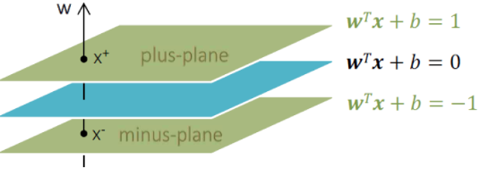

#### 초평면의 식

우리가 찾아야 하는 분류경계면 : wTx + b 라고 두면 벡터 w는 경계면과 수직인 법선벡터가 된다.

H = wTx + b = 0

> w = weight, x = input vector, H = hyperplane

- 여기서 **가중치 벡터 w**는 서포트벡터들 사이의 여백을 가장 크게 하는 **초평면의 방향**을 뜻한다.
- **H**는 서포트 벡터들 사이의 여백을 가장 크게 하는 **결정 초평면의 위치**를 뜻한다 —> 우리가 찾아야 하는 분류 경계면

이해하기 쉽도록 w를 2차원 벡터 (w1, w2) 라고 두면,

w에 대해 원점과의 거리가 b인 직선의 방정식은 wTx + b = w1x1 + w2x2 + b = 0 이 된다.

이 직선의 기울기는 -w1/w2 이고, 법선벡터 w의 기울기는 w2/w1 이므로 두 직선은 **수직**이다!

(차원을 확장해도 마찬가지임)

#### margin 길이 유도하기

그러므로 우리는 plus-plane 위의 벡터 **x+와**, minus plane 위의 **x- 사이의 관계**를 다음과 같이 정의할 수 있다.

> x- 를 w 방향으로 평행이동 시키되, 이동하는 폭은 λ 로 scale 한다는 뜻

x+와 x- 사이의 관계식을 활용해서 **λ 의 값**을 다음과 같이 유도할 수 있다.

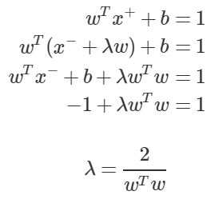

이제 λ의 값을 알고 있으므로 plus-plane과 minus-plane 사이의 거리인 **margin**을 다음과 같이 유도할 수 있다.

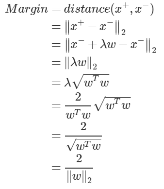

#### margin 최대화 하기

위와 같이 margin의 width 값을 구했으니, 이것을 최대화하는 w와 b를 찾으면 된다.

계산상 편의를 위해 마진의 절반을 제곱한 것에 역수를 취한 뒤 그 절반을 최소화하는 문제로 바꿀 수 있다고 한다...

그렇게 해도 문제의 본질은 바뀌지 않는다.

그 후 라그랑주 승수법을 사용하여 조건부 최적화 문제를 KKT 조건을 이용하여 풀이한다.

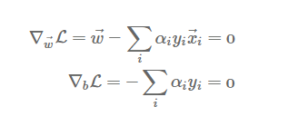

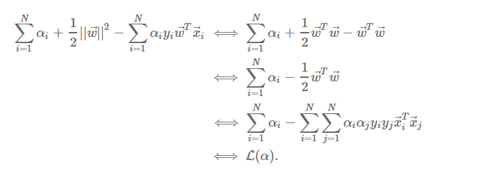

이 정리된 식을 통해 a값을 구할 수 있고 이어서  **w**값도 구할 수 있으며 제약조건을 통해 **b**값도 구할 수 있게 된다. 

이를 통해 모든 변수를 구하고 우리는 결정초평면을 구할 수 있다.

### 단점

그러나 위 분류기의 치명적인 단점이 있다.

**선형으로 모든 데이터를 완벽하게 분리할 수 없다는 것 !**

그러면 어떻게 해야 할까? 한 두개정도야 뭐 …하고 약간의 오분류를 허용해 줄 수 있다.

## Soft Margin Classifier

: 분류된 데이터를 일부 허용 하는 모델.

### '일부'를 어느정도로 설정해야 할까?

몇개의 개념 추가

- 슬랙 변수 (e, Slack variable) : 데이터 포인트의 위치
  - e = 0 	: 올바른 분류
  - 0 < e < 1 : 올바른 분류이지만 Margin을 넘은 경우
  - e > 1 	: 잘못된 분류
- 잘못 분류된 데이터 포인트에 패널티를 부여하는 것.

1. 각각의 데이터 포인트에 대해 슬랙 변수 값을 모두 구함
2. 그 값들을 모두 더함
3. 더한 값의 의미 : 얼마나 많은 변수들이 잘못 분류되었는가
4. 모든 슬랙 변수를 더한 값이 너무 커짐 = 너무 많은 오류를 허용한다. 제대로 분류가 되지 않는다

그래서 이 값에 한계를 주는 최대비용을 설정해야 한다.

## SVM 모델 parameter

#### tuning parameter C

이 최대비용을 tuning parameter C 로 설정한다.

> 위 식에서 나머지는 데이터에 따라 계산되는 것이고, 사용자가 조정할 수 있는 파라미터는 C.

- default = 1.0
- 얼마만큼의 여유를 가지고 오류를 인정할 것인지의 값.
- 값을 낮출 경우, 초평면이 매끄러워짐.
  - 제약이 큰 모델을 만들고 각 포인트의 영향력이 적음
- 값을 높일 경우, 서포트 벡터들을 더 잘 분류함
  - 각 포인트들이 모델에 큰 영향을 주며 결정 경계를 휘어서 정확하게 분류함

- C 가 너무 크면 과소적합 (underfitting)
- C 가 너무 작으면 과적합 (overfitting)

이 발생한다.

### Kernel

: 차원을 이용하여 SVM을 효율적으로 사용할 수 있게끔 해주는 함수

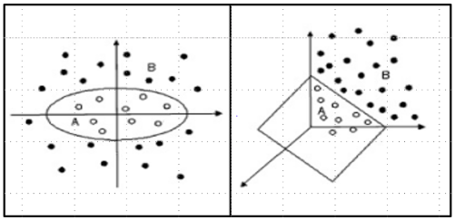

- 선형 분리가 불가능한 저차원의 데이터를 고차원 공간의 값으로 매핑시켜서 선형평면(Hyperplane)으로 분류를 가능하게끔 만들어줌

- 서포트 벡터 분류기를 확장하여 비선형의 클래스 경계를 수용하는 분류방법 중 하나

- 차원이 높아지며 높은 계산비용이 발생할 수 있는데 이를 해결

- 서포트 벡터 머신 (SVM)은 커널을 사용하여 특정한 방식으로 변수 공간을 확장한 결과.

  > [여기](http://crsouza.com/2010/03/17/kernel-functions-for-machine-learning-applications/#gaussian) 엔 엄청 많지만 자주 쓰는 것들만 보자면

- 종류
  - RBF(Radial Basis Function)(디폴트값) / 가우시안 커널

    - 특정 중심에서 거리에 의존하는 값
    - 차원이 무한한 특성 공간에 매핑하는것
    - 가우시안 커널은 RBF 커널의 한 예시
    - 
    - 이렇게도 나타낼 수 있다

    

  - Polynomial, Sigmoid

    - Polynomial : 원래 특성의 가능한 조합을 지정된 차수까지 모두 계산

#### Gamma

- default —> 임의로 설정
- 값을 낮출 경우
  - 초평면에서 멀리 떨어진 서포트벡터들의 영향이 적어짐
  - 가우시안 커널의 반경을 크게하여 많은 포인트들이 가까이 있는것으로 고려함
  - 결정 경계를 천천히 바뀌게 하므로 모델의 복잡도를 낮춘다.
- 값을 높일 경우
  - 멀리 떨어진 요소들의 영향이 커짐
  - 결정 경계는 하나의 포인트에 더 민감해진다
  - 모델이 복잡해진다
- 초평면에 인접한 서포트 벡터들의 영향(w)이 커지기 때문에, 초평면이 울퉁불퉁(uneven) 해짐

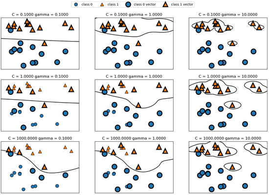

> C와 gamma 매개변수 설정에 따른 결정 경계와 서포트 벡터

## Parameter의 변화에 따른 Overfitting

- Overfitting
  - 과도하게 훈련된 데이터에 모델이 최적화된 경우
  - Machine Learning 에서는 이런 경우를 피해야 함
  - SVM parameters인 Kernel, C, Gamma는 overfitting에 영향을 주는 요소 중 일부

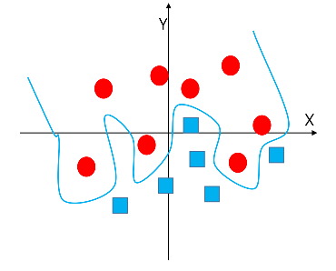

- 무시해야 할 노이즈나 아웃라이너 데이터까지 모두 정상으로 인식하고 학습함
  - 학습 에러는 낮지만 왜곡된 학습 모델이 결정되면 검증 시 에러율이 높아진다.
- Overfitting 이 되지 않도록 parameter를 잘 조정해야 함

> 데이터 파라미터 조정 실습은 [여기](https://blog.naver.com/a_aaaaaa/221153286250) 참고