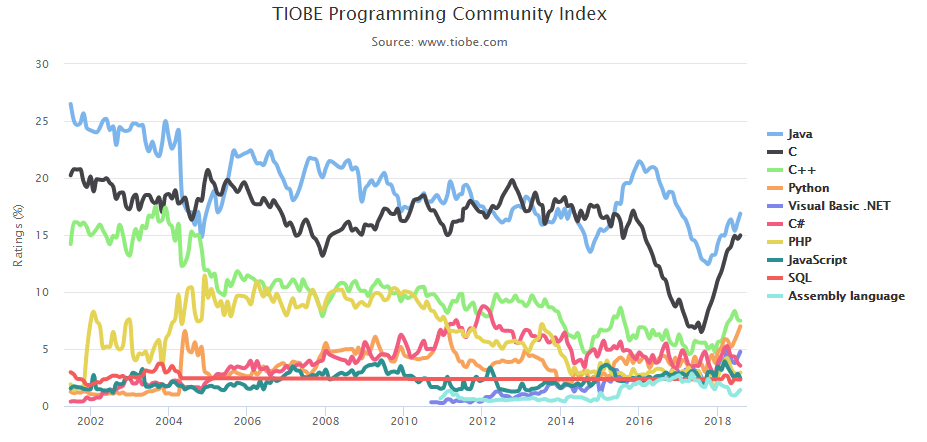
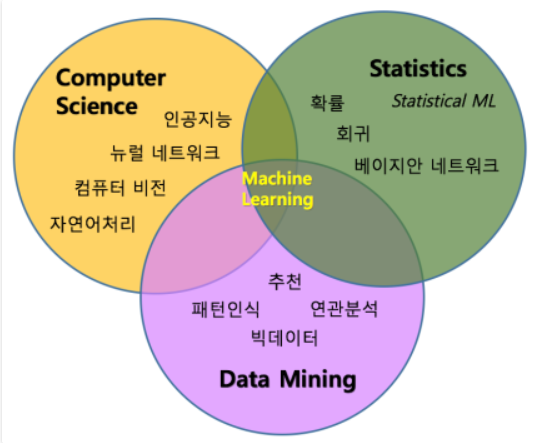

# ML 스터디 1주차 : Python Deep dive

## **남궁선**

### ***역사***
- 제작자 : Guido van Rossum
- Python 1.x : 1991년 발표
- Python 2.x : 2000년 10월 6일 배포
- Python 3.x : 2008년 12월 3일 배포

### ***특징***
- Platform independent : plaform 독립적
- Interpreter : C Interpreter 사용(표준)</br>
-> 현대에는 컴파일하여 바이너리 코드로 저장한 뒤 재실행시 바이너리 코드를 실행하여 속도를 향상시킨다.
- OO : 객체지향
- Dynamic typing : 실행 시 자료형 검사
- 다양한 유니코드 문자열 지원
- 들여쓰기를 사용하여 블록을 구분한다(공백 4칸).
- C/C++ 에 비하여 상대적으로 속도가 떨어지나, 범용으로는 큰 문제가 없다.
- Garbage Collector 가 내부에서 동작한다.
- Window, Mac OS, Unix, Linux, Palm OS 지원
- 쉬운 사용법, 활용도 높은 수학 라이브러리들, 범용성 등으로 인해 ML에서 많이 사용되어진다.
- 단점으로 여겨지는 속도로 인해 C++ ML 프레임워크가 활성화가 되는 추세 


### ***철학***
- Beautiful is better than ugly
- Explicit is better than implicit
- Simple is better than complex
- Complex is better than complicated
- Readability counts

### ***자료형***
1. 기본 자료형
    - Integer :int
    - Floating point : float
    - Complex number : complex
    - String : str
    - Unicode string    
    - Boolean : bool
    - Function
    - Bytes
    - Class

2. 집합형 자료형
    - List : list
    - Tuple : tuple
    - Dictionary : dict
    - Set : set, frozenset

### ***기술***
1. 유니코드    
    - 유니코드 문자열의 한 글자가 플랫폼 및 빌드 옵션에 따라 무조건 1 or 2 or 4 바이트를 차지한다. 문자열 객체에서 가장 많은 공간(바이트)을 차지하는 문자를 기준으로 각 문자가 차지할 공간을 정한다.

2. CPython(표준)    
    - C로 구현된 파이썬. 파서, 인터프리터가 C로 구현되어있다.    

3. Multi Threading    
    - 파이썬은 멀티스레딩을 지원하기 위하여 GIL(Global Interpreter Lock), 즉 전역 인터프리터 락을 도입하여 사용하게 되었다. 따라서, python 스레드 10개를 만들어도 실제 Pthread/윈도우 스레드가 10개가 만들어지긴 하는데, GIL때문에 개중 동시에 하나밖에 안돌아가는 기이한 구조를 갖고 있다. 물론, 내부적으로 IO작업이 있을 시 바로 다른 스레드로 문맥 교환을 해주고, 바이트 코트를 100번 실행한 다음에는 인터프리터 차원에서 다른 스레드로 교체 해주므로 동시 작업 비슷한 효과가 난다. 이것은 구현이 매우 쉬워지고 빠른 개발을 할 수 있다는 장점이 있으나, 다중 코어 CPU가 보편화된 2006년 이후에는 다중 코어를 제대로 활용하지 못하는 구조적인 문제 때문에 성능에서 밀린다는 평가를 받게 되었다. 만일 특정 프로그램에 순진하게 CPU 코어를 2개 이상 동원하려고 할 경우, 뮤텍스(MutEx), 즉 한 스레드에 여러 개의 CPU가 연산을 행하여 내부 정보를 오염 시키는 것을 방지하는 역할을 맡는 GIL이 병목 현상을 일으켜 코어 하나를 쓸 때보다 오히려 성능이 크게 저하된다.

    - 이런 문제점 때문에 파이썬에서 병렬 처리가 필요할 때는 다중 스레드가 아닌 다중 프로세스로 GIL을 우회하는 방식을 사용한다. 2008년 이후에 multiprocessing이라는 모듈을 제공하는데 이 모듈은 자식 프로세스를 만드는 방향으로 다중 코어 사용 시 성능의 향상을 추구하고있다.    

4. Reference Cound    
    - 모든 객체는 참조 당할 때 레퍼런스 카운터를 증가시키고 참조가 없어질 때 카운터를 감소시킨다. 이 카운터가 0이 되면 객체가 메모리에서 해제한다.
    
5. Referece cycle    
    ```
    자기 자신을 참조한다.

    그러나
    >>> a = Foo()  # 0x60
    >>> b = Foo()  # 0xa8
    >>> a.x = b  # 0x60의 x는 0xa8를 가리킨다.
    >>> b.x = a  # 0xa8의 x는 0x60를 가리킨다.
    # 이 시점에서 0x60의 레퍼런스 카운터는 a와 b.x로 2
    # 0xa8의 레퍼런스 카운터는 b와 a.x로 2다.
    >>> del a  # 0x60은 1로 감소한다. 0xa8은 b와 0x60.x로 2다.
    >>> del b  # 0xa8도 1로 감소한다
    이 상태에서 0x60.x와 0xa8.x가 서로를 참조하고 있기 때문에
    레퍼런스 카운트는 둘 다 1이지만 도달할 수 없는 가비지가 된다.
    ```
6. Garbage Collector    
    - 파이썬의 gc 모듈을 통해 가비지 컬렉터를 직접 제어할 수 있다.

    - 파이썬에선 기본적으로 garbage collection(가비지 컬렉션)과 reference counting(레퍼런스 카운팅)을 통해 할당된 메모리를 관리한다. 기본적으로 참조 횟수가 0이 된 객체를 메모리에서 해제하는 레퍼런스 카운팅 방식을 사용하지만, 참조 횟수가 0은 아니지만 도달할 수 없지만, 상태인 reference cycles(순환 참조)가 발생했을 때는 가비지 컬렉션으로 그 상황을 해결한다.

    - 가비지 컬렉터는 내부적으로 generation(세대)과 threshold(임계값)로 가비지 컬렉션 주기와 객체를 관리한다. 세대는 0세대, 1세대, 2세대로 구분되는데 최근에 생성된 객체는 0세대(young)에 들어가고 오래된 객체일수록 2세대(old)에 존재한다. 더불어 한 객체는 단 하나의 세대에만 속한다. 가비지 컬렉터는 0세대일수록 더 자주 가비지 컬렉션을 하도록 설계되었는데 이는 generational hypothesis에 근거한다.

    - n세대에 객체를 할당한 횟수가 threshold n을 초과하면 가비지 컬렉션이 수행되며 이 값은 변경될 수 있다.(threshold 값은 세대별로 다르다)

    - 가비지 컬렉션이 수행된 n세대의 객체는 가비지 컬렉터에 의해 정리되며, n+1세대로 이동한다.

    - 가비지 컬렉터는 모든 객체를 추적하여 순환참조를 감지한다.
--------------
## **정초이**


### ***파이썬?***
귀도 반 로섬....^- ^ 생략 생략

### ***Zen of Python***

```
Beautiful is better than ugly.
Explicit is better than implicit.
Simple is better than complex.
Complex is better than complicated.
Flat is better than nested.
Sparse is better than dense.
Readability counts.
Special cases aren't special enough to break the rules.
Although practicality beats purity.
Errors should never pass silently.
Unless explicitly silenced.
In the face of ambiguity, refuse the temptation to guess.
There should be one—and preferably only one—obvious way to do it.
Although that way may not be obvious at first unless you're Dutch.
Now is better than never.
Although never is often better than right now.[n 1]
If the implementation is hard to explain, it's a bad idea.
If the implementation is easy to explain, it may be a good idea.
Namespaces are one honking great idea—let's do more of those!
```

### ***파이썬의 특징***
- 가독성
	- 코드의 블럭을 들여쓰기로 구분하여 문장이 깔끔함
- 문법이 간결하고 표현 구조가 인간의 사고 체계와 비슷함
	- 초보자가 배우기 쉬움
	- 유지 보수, 관리가 쉬움
	- 같은 내용을 구현할 때 비교적 코드 줄 수가 적음
- 독립적 플랫폼
	- 다양한 플랫폼에서 사용 가능
- 내/외부에 프레임워크, 라이브러리가 풍부함
	- 다양한 용도로 확장하기 좋음
	- 리눅스의 경우 pip를 사용하여 라이브러리를 설치함
- 생산성이 높음
- 다양한 분야에 사용 중
	- 데이터 분석, 머신러닝, 그래픽, 학술 연구 등
-  인터프리터 언어(동적 언어), 연산 속도가 C에 비해 30~70배 까지 떨어짐
	- CPU 발달로 해결이 되는 중
	- 접착성이 좋아서 C로 구현된 모듈을 쉽게 붙일 수 있음,
	  C로 구현하여 해결하거나 반대의 경우도 가능


### ***파이썬의 기술***
- 행렬 연산을 잘 해주기 위한 플랫폼
	- 넘피(Numpy), 사이파이(Scipy), 판다스(pandas) 등의 솔루션
- 텐서플로우
	- low level 머신러닝 언어
	- 빠름
- scikit-learn : 독보적인 파이썬 머신러닝 라이브러리
	- 자유로운 사용과 배포
	- 활발한 커뮤니티
	- 풍부한 documantation
	- 많은 튜토리얼, 예제 코드
	- 다른 파이썬의 과학 패키지와 연동
	- Numpy, Scipy 사용
- matplotlib : 그래프 그리기
- IPython, 주피터 노트북 : 대화식 개발

### ***파이썬 배포판***
- Anaconda
	- Numpy, Scipy, matplotlib, pandas, IPython, Jupyter Notebook, scikit-learn 포함
	- macOS, 윈도우, 리눅스 지원
	- 파이썬 과학 패키지가 없는 사람에게 추천
	- 바이너리 의존성 등의 문제 해결 위해 자체적인 패키징 매커니즘 가짐
	- 상용 라이브러리인 인텔 MKL 라이브러리도 포함
		- scikit-learn의 여러 알고리즘이 훨씬 빠르게 동작
- Enthought Canopy
	- 파이썬 2.7.x
- Python(x,y)
	- 윈도우 환경
 
- 파이썬을 이미 설치했다면
```python
pip install numpy scipy matplotlab ipython scikit-learn pandas pillow
```

### ***파이썬이 ML에 선호되는 이유***
- 범용 프로그래밍 언어의 장점
	- GUI나 웹 서비스 제작 가능
	- 기존 시스템과 통합 용이
- 매트랩*MATLAB*과 R 같은 특정 분야를 위한 스크립팅 언어의 편리함
- 데이터 적재, 시각화, 통계, 자연어 처리, 이미지 처리 등에 필요한 라이브러리
- 터미널 / 주피터 노트북*Jupyter Notebook* 같은 도구로 대화하듯 프로그래밍
- 반복 작업을 빠르게 처리하고 손쉽게 조작할 수 있음
- 메모리를 대신 관리함
--------------
## **조민지**

### 1. 누가 만들었는가?
  * 파이썬이란 1990년 암스테르담의 귀도 반 로섬(Guido Van Rossum)에 의해 만들어진 `인터프리터` 언어이다.
  > Interpreter vs compiler ?  우선 컴파일러는 전체를 모두 변환하여 실행합니다. 하지만 인터프리터의 경우 한 줄 단위로 변환 및 실행을 반복합니다. 이는 마치 번역하는 것과 비슷합니다.
  * 
### 2. 사전적 의미는?
  * 고대 신화 속의 파르나수스(Parnassus) 산의 동굴에 살던 큰 뱀으로서, 아폴로가 델파이에서 파이썬을 퇴치했다는 이야기가 전해지고 있다.
### 3. 점유율은? 사용 범위는?
  * TIOBE Index for April 2018
    * 해당 프로그래밍 언어를 이용하는 엔지니어 및 업체의 수와 Google, Bing,Yahoo 등의 검색 엔진을 통해 검색되는 결과물의 수를 바탕으로 순위를 결정한다. 따라서 TIOBE index는 C/C++이나 Java와 같이 전통적인 프로그래밍 언어의 순위를 높게 산정하는 경향이 있다.
    * 
    * 
  * RedMonk Programming Language Rankings June 2018
    * GitHub에서 해당 프로그래밍 언어로 작성된 소스 코드의 수와 Stack Overflow 에서 해당 프로그래밍 언어에 대한 논의가 이루어지고 있는 페이지수를 합산하여 순위를 결정한다. 따라서 얼마나 활발하게 해당 언어를 이용한 프로젝트가 진행되고 있고, 해당 언어에 대한 논의가 이루어지고 있는지에 따라 순뤼가 결정된다. 즉, 소스 코드의 배포가 활발하거나 많은 이슈가 있는 언어의 순위가 높게 산정되는 경향이 있다.
    * 
    * 

### 4. 장점은?
  * 읽고 사용하기 쉽다 -> 프로그램을 유지 보수하거나 개선하기 쉽다.
  * 비동기식 코딩 -> 혼란스러운 자원 경쟁이나 교착상태가 발생하지 않는다.
  * 자바보다 뛰어난 멀티패러다임 접근방식 ?
  * Python은 C언어로 구현된 라이브러리를 , 그대로, 간단하게 사용할 수 있다.
### 5. 할 수 있는 것은?
  * 시스템 유틸리티 제작
  * GUI 프로그래밍
  * C/C++ 와의 결합
  * 웹 프로그래밍
  * 수치 연산 프로그래밍
  * 데이터베이스 프로그래밍
  * 데이터 분석, 사물 인터넷
### 6. 단점은?
  * 속도 느리다.
  * 모바일 컴퓨팅과 브라우저 부재 -> 파이썬으로 개발된 application이 거의 없다.
### 7. 할 수 없는 것은?
  * 시스템과 밀접한 프로그래밍 영역
  * 모바일 프로그래밍
### 8. ML이란?
  * 컴퓨터가 사전에 미리 프로그램되어 있지 않고 데이터로부터 패턴을 학습하여 새로운 데이터에 대해 적절한 작업을 수행하는 일련의 알고리즘이나 처리 과정
  * 컴퓨터 과학(Computer Science), 통계(Statistics), 데이터 마이닝(Data Minig)분야와 밀접한 관련이 있다.
  * 
### 9. ML에 사용되는 이유는?
  * 파이썬은 데이터 과학 분야를 위한 표준 프로그래밍 언어가 되어 가고 있다. 파이썬은 범용 프로그래밍 언어의 장점은 물론 MATLAB과 R 같은 특정 분야를 위한 스크립팅 언어의 편리함을 가지고 있다.
  * 프로그래밍이 단순해진다.
    * 언어의 간소함, 읽는게 편하다.
  * 머신러닝 라이브러리가 있다.
    * 풍부한 머신러닝 라이브러리과 프레임워크가 제공된다. (Scikit-learn, TensorFlow, CNTk, 아파치 스파크 MLlib)
  * 메모리를 대신 관리한다.
    * 파이썬은 프로그래머 대신 세부적인 메모리 관리를 수행하므로 결과적으로 개발자에게 개발 관련 문제에 집중할 수 있는 정신적인 여유를 제공한다.
    * 머신러닝 앱은 파이썬의 메모리 관리 구조를 실제 연산 작업보다는 애플리케이션의 로직 또는 데이터 흐름 정리를 위한 용도로 더 활용된다.
  * 파이썬이 느려도 상관없다.
    * 파이썬이 가장 빠른 언어가 아닌데도 머신러닝 같은 연산 집약적인 작업에 사용하는 이유는 무엇일까?  연산 집약적인 작업을 처리하는 것은 파이썬이 아니다.  
    * 파이썬 머신러닝 애플리케이션에서 수행하는 실제 연산작업 대부분은 일반적으로 C, C++, Java 등으로 작성한다. 파이썬은 라이브러리를 통해 이를 정리하고 상호작용할 뿐이다.